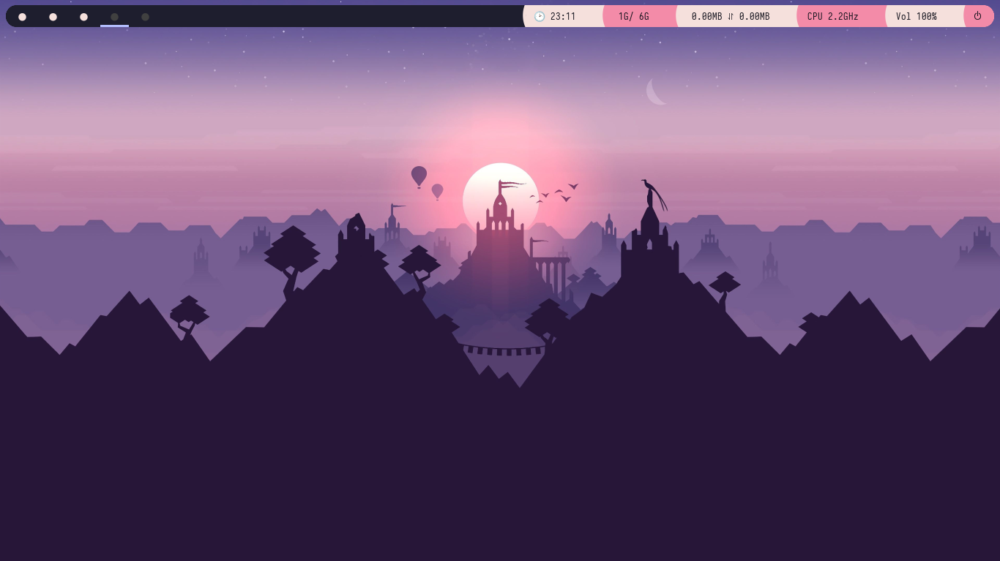
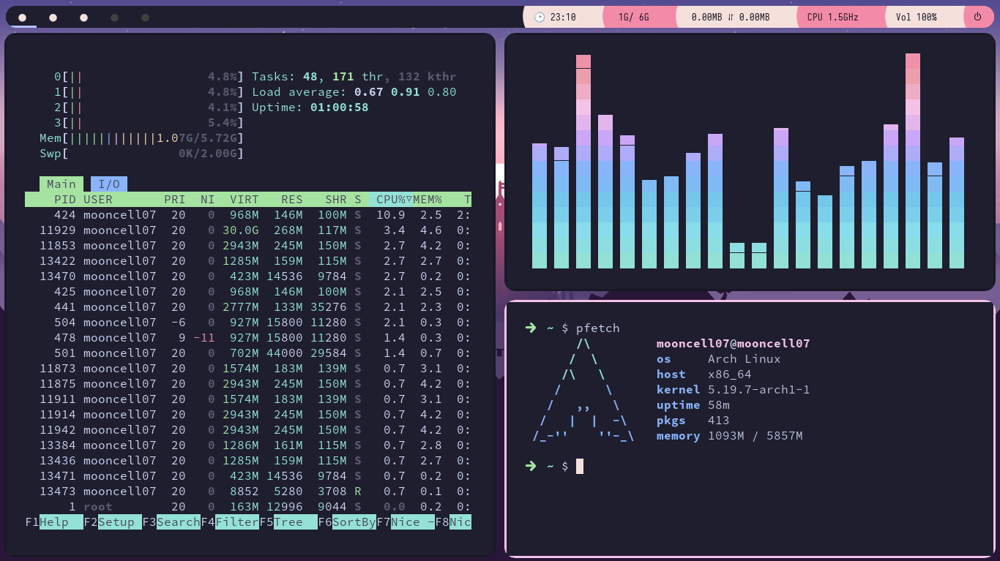

# Welcome
This repo is for tracking Dotfiles for my system.\
*ps*: Don't bother trying it out cuz there's 90% chance it will break for you :')

# Screenshots:
*(ik it's not properly following the Catppuccin Style Guide smh)*

- **Wallpaper that i stole from somewhere**

- **Freak you Qtile**

# Specs:
- **OS**: Arch Linux
- **WM**: Qtile
- **Terminal**: Alacritty
- **Compositor**: Picom
- **Theme**: [Catppuccin Mocha](https://github.com/catppuccin/catppuccin)
- **Editor**: Neovim (conf WIP)

# Note (to myself):
will make an install script later smh

- Install *noto-fonts, noto-emojis, noto-fonts-cjk, noto-fonts-extra, ttf-croscore, ttf-iosevka* fonts.
- yeah thats all ig

### Heavily Inspired from this stinky's ([zeffo](https://github.com/zeffo)) setup.
