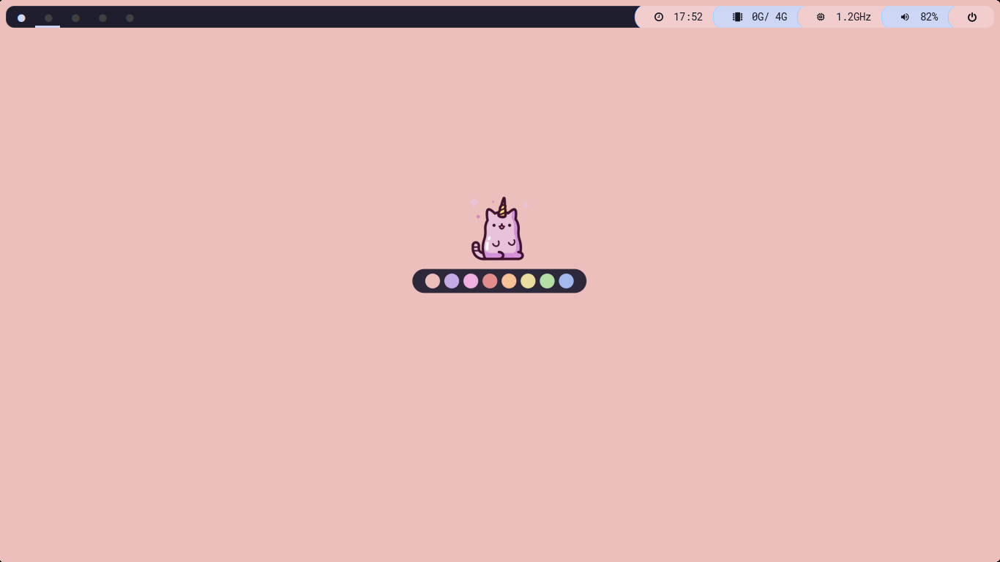
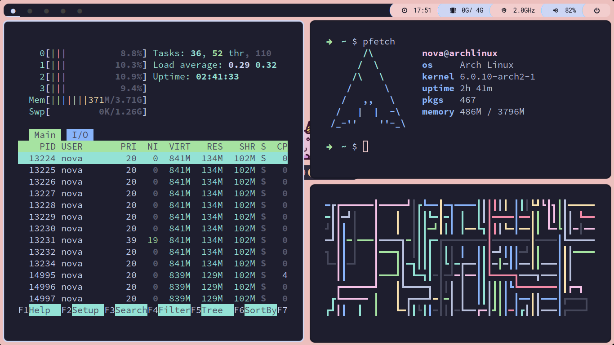

# Welcome
This repo is for tracking Dotfiles for my system.\
*ps*: Don't bother trying it out cuz there's 90% chance it will break for you :')

# Screenshots:
*(ik it's not properly following the Catppuccin Style Guide smh)*

# Specs:
- **OS**: Arch Linux
- **WM**: Qtile
- **Terminal**: Alacritty
- **Compositor**: Picom
- **Theme**: [Catppuccin Mocha](https://github.com/catppuccin/catppuccin)
- **Editor**: Neovim (conf: AstroNvim)

### Heavily Inspired from this stinky's ([zeffo](https://github.com/zeffo)) setup.
