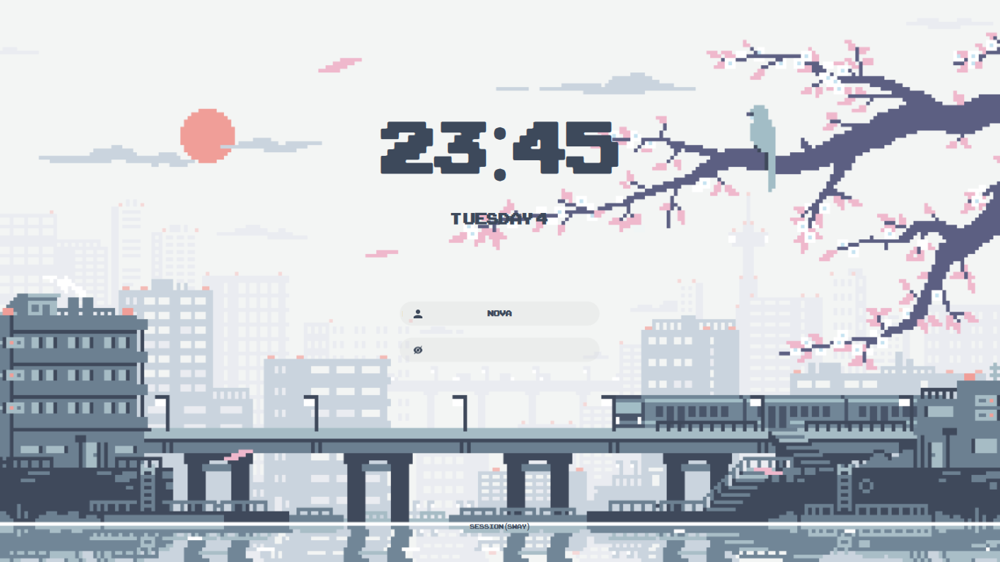
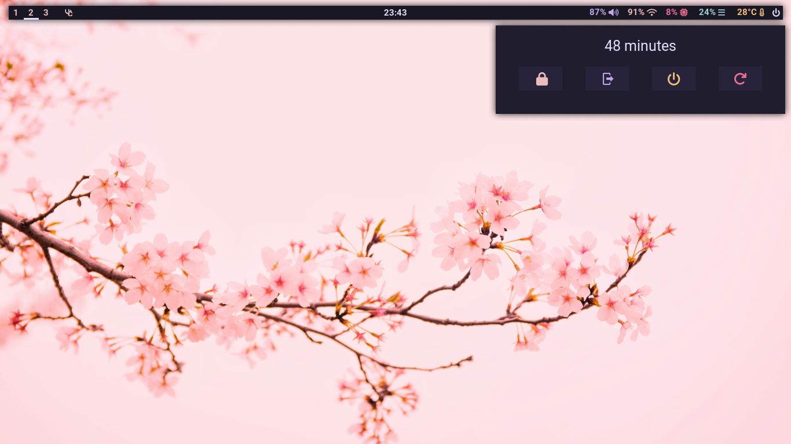
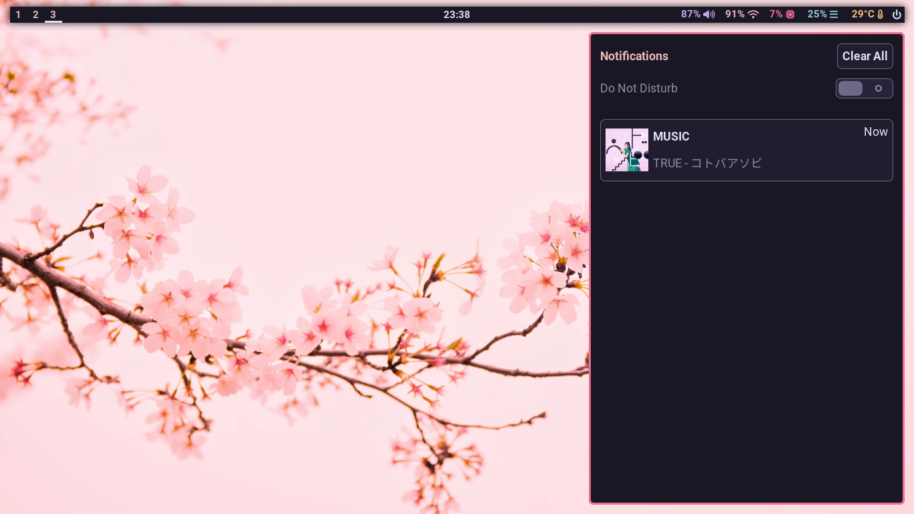
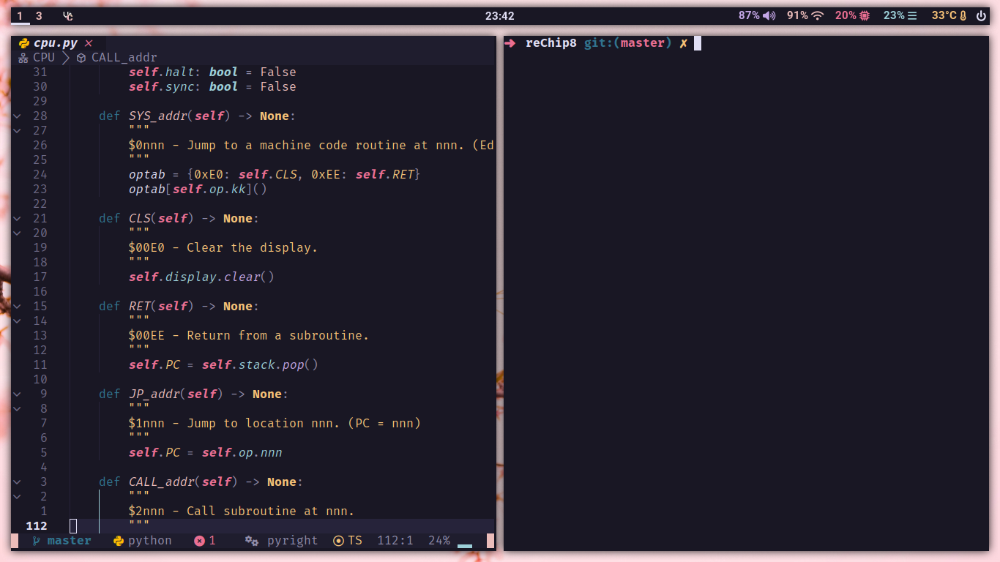
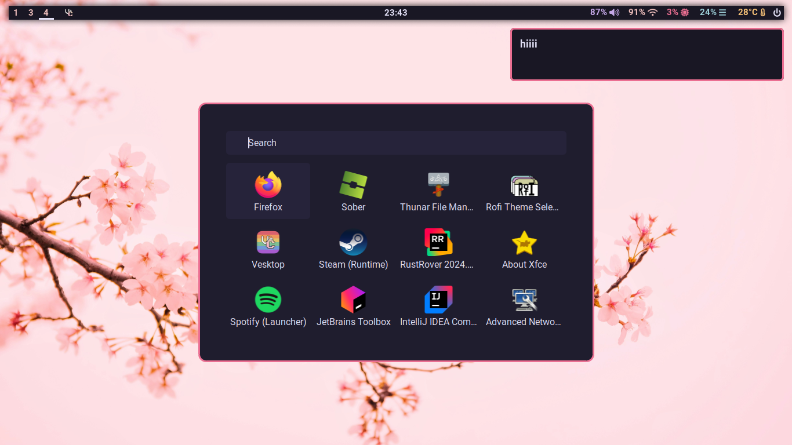

# Dotfiles v3
Dotfiles for my Arch-based System.

## Config
- **OS**: Arch Linux
- **WM**: SwayFX
- **Bar**: Waybar
- **Theme**: Rosé Pine
- **Terminal**: Foot
- **Shell**: Z Shell (with Oh My Zsh)
- **Text Editior**: Neovim
- **Notification Manager**: Swaync
- **Display Manager**: SDDM
- **Application Launcher**: Rofi Wayland
- **Session Locker**: Swaylock
- **Power Menu**: Eww

## Screenshots

