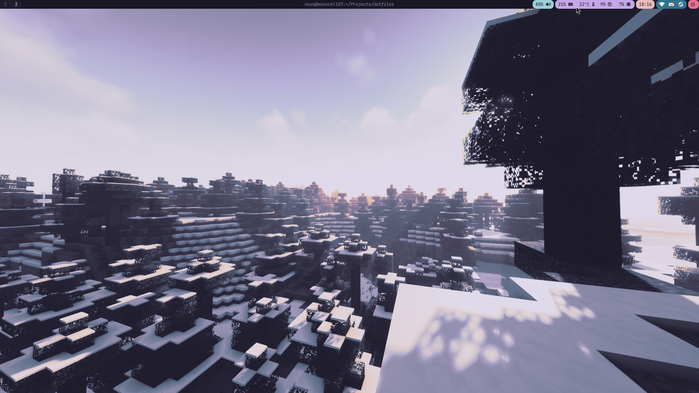
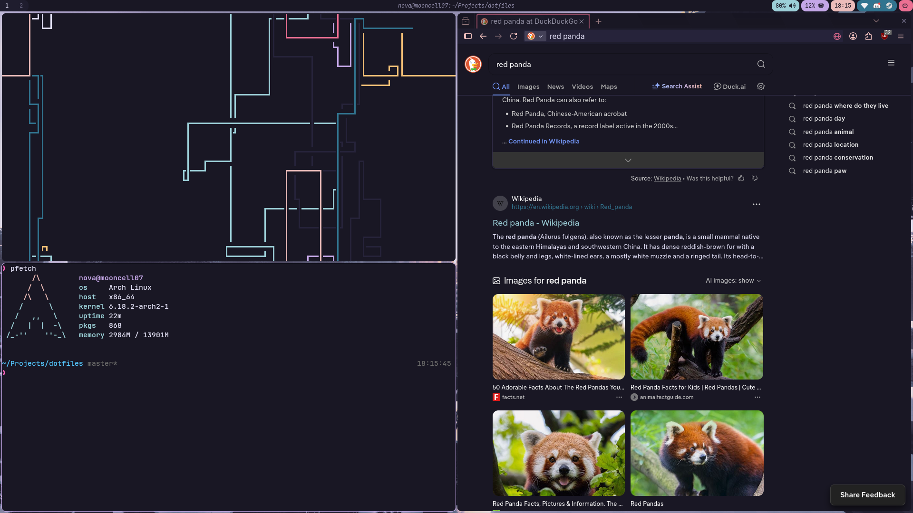
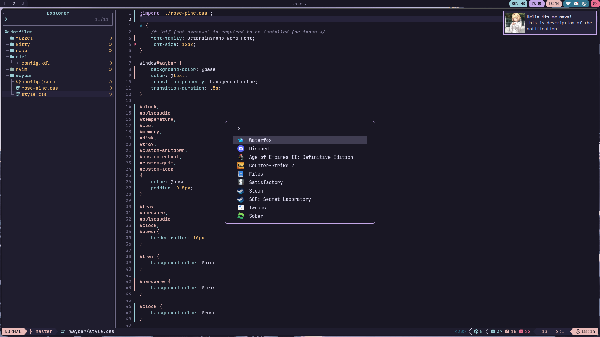

# Dotfiles
Dots for my current Arch Linux installation.

## Screenshots

## Info.
- Distro. - Arch Linux (btw)
- WM - Niri
- Colorscheme - Rose Pine
- Wallpaper (Subject to change) - Minecraft Snow Hills Sunset by [ne](https://github.com/neyfua)
- Bar - Waybar
- Terminal - Kitty
- Shell - zsh with oh-my-zsh powerlevel10k
- Application Launcher - Fuzzel
- Notification Daemon - Mako
- Editor - Neovim (Lazyvim)
- Browser - Waterfox
